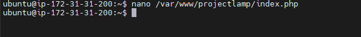

# WEB STACK IMPLEMENTATION FOR LAMP STACK- Linux, Apache, MySQL, PHP or Python, or Perl

## Prerequisites needed to ;
- AWS free tier account(This has been created already).
- EC2 instance connected and running on ssh.
- Windows Powershell downloaded and connected to  instance by running the PEM key.

## EC2 running on AWS
- `EC2Running` : This image shows the Lamp instance already up and running (P.S the ip address was covered for security reasons).
    - see image below :point_down:

## Using PEM key to connect to EC2 instance via windows powershell
For this to be connected successfully the below commands needs to run;
- ***cd download*** : This command was used to move into the into the downloads folder as this is folder the PEM key was stored in.
    - See image `cd downloads` below :point_down:

- ***ssh -i lamp&lemp.pem ubuntu@x4.xx3.1xx.xx0*** : This command was used to connect the PEM key to the EC2 instance using the windows powershell. although the initial command didnt work as i had to wrap  the ampersand(&) in double quotation marks ("&") so i used this command (***ssh -i lamp"&"lemp.pem ubuntu@4.xx3.1xx.xx0***). 

See image `InstanceConnection (1)` below :point_down:
.PNG>)

See image `InstanceConnection (2)` below :point_down:
.PNG>)

## Installing Apache and Updating the Firewall
Apache is an open source software available for free. it runs on 67% of all webserves in the world. It is fast, reliable, and secure. it can be highly customized to meet the needs of many diiferent environments by using extensions and modules. Most WordPress hosting providers use Apache as their web server software, websites and other applications can run on other web server software as well as Nginx, Microsoft IIS, etc. After we have the EC2 instance running and PEM conect to the windows powershell, we will now proceed by installing Apache and Updating the firewall by running following commands below.

- ***$ sudo apt update*** : This command was used to update a list of packages. 

See image `SudoAptUpdate (1)` below :point_down:
.PNG>)

See image `SudoAptUpdate (2)` below :point_down:
.PNG>)

See image `SudoAptUpdate (3)` below :point_down:
.PNG>)

- ***$ sudo apt install apache2 -y*** : This command was used to run apache2 package installation. 

See image `SudoAptInstallApache2 (1)` below :point_down:
.PNG>)

See image `SudoAptInstallApache2 (2)` below :point_down:
.PNG>)

See image `SudoAptInstallApache2 (3)` below :point_down:
.PNG>)

- ***$ sudo systemctl status apache2*** : This command was used to verify that Apache is running using. If it is green and running that means that the apache was installed correctly.

See image `SudoSystemctlStatusApache2` below :point_down:

- ***$ curl http://localhost:80*** : This command was used to request the apache HTTP Server on port 80 using the DNS name eithier this can be pasted on your web browser to enable it display the Ubuntu Apache2 default page. 
 - See image `CurlWebAccess (1)` below :point_down:
 .PNG>)

 - See image `CurlWebAccess (2)` below :point_down:
 .PNG>)

 - See image `CurlWebAccess (3)` below :point_down:
 .PNG>)

OR you can copy the IP address and paste it on your browser to confim that Apache2 works correctly. either you do the above or below you shpuld get the below in your web browser. 
See image  `UbuntuApache2Default page` below :point_down:

## Installing MySQL
MySQL is a popular database management system used within PHP environments
- ***$ sudo apt install mysql-server***: This command was used to install the software.

See image `InstallMySQLserver (1)` below :point_down:
.PNG>)

See image `InstallMySQLserver (2)` below :point_down:
.PNG>)

See image `InstallMySQLserver (3)` below :point_down:
.PNG>)

See image `InstallMySQLserver (4)` below :point_down:
.PNG>)

See image `InstallMySQLserver (5)` below :point_down:
.PNG>)

- ***$ sudo mysql*** : When the above is done installing this command was used to log in to the MySQL console. This will connect to the MySQL server as the administrative database user root, which is inferred by the use of sudo when running this command. it's recommended that you run a security script that comes pre-installed with MySQL. This script will remove some insecure default settings and lock down access to your database system. Before running the script you will set a password for the root user, using ***mysql_native_password*** as default authentication method. This command was used for it ***mysql> ALTER USER 'root'@'localhost' IDENTIFIED WITH mysql_native_password BY 'password';***. ***mysql> exit*** can be used to exit MySQL shell.

See image `ConnectingSQLnativePasswordAndExit` below :point_down:

- ***$ sudo mysql_secure_installation*** : This command can be used to start the interactive script. This will ask if you want to configure the ***VALIDATE PASSWORD PLUGGIN***, please note that if you leave validation disabled and you run ***sudo mysql*** and input the native password you used, you may get an error feedback like ***ERROR 1045 (28000): Access denied for user 'root'@'localhost' (using passowrd: password)*** so its advisable you enable ***VALIDATE PASSWORD PLUGIN*** and enter 2 for strongest level as you will receive errors when attempting to set any password which does not contain a mix of uppercase, lowercase, special characters and number or which is based on common dictionary words e.g PassWord.1 will not be rejected by MySQL with an error and also answer Y for yes for the rest of the questions and hit enter. When you set up the ***VALIDATE PASSWORD PLUGIN***, your server will ask you to select and confirm a password for the MySQL root user. The database root user is an administrative user with full privileges over the database system.

See image `MySQLSecureInstallationWithPASSWORDchange` below :point_down:

- ***$ sudo mysql -p*** : This command was used to test if one is able to log into the MySQL console, -p flag in this command will prompt you for the password used after changing the root user password and to exit the MySQL console for this you will use the password you created in the above step, type ***mysql> exit***

See image `MySQLtestLoginwithChangedPassword` below :point_down:

## Installing PHP
PHP is the component of our setup that will process code to display dynamic content to the end user.

- ***$ sudo apt install php libapache2-mod-php php-mysql*** : This command was used to enable apache to handle PHP files. Core PHP packages will automatically be installed as dependencies.

See image `InstallPHPandDependencies (1)` below :point_down:
.PNG>)

See image `InstallPHPandDependencies (2)` below :point_down:
.PNG>)

See image `InstallPHPandDependencies (3)` below :point_down:
.PNG>)

- ***php -v*** : This command was used to confirm the PHP version that was installed. See image `php-v` below :point_down:

## Enabling PHP on the website
With the default DirectoryIndex settings on Apache, a file named index.html will always take precedence over an index.php file. This is useful for setting up maintenance pages in PHP applications, by creating a temporary index.html file containing an informative message to visitors. Because this page will take precedence over the index.php page, it will then become the landing page for the application. once maintenance is over, the index.html is renamed or removed from the document root, bringing back the regular apllication page.

- ***sudo vim /etc/apache2/mods-enabled/dir.conf*** : This command was used to edit the vim text editor and change the order in which the index.php file is listed within the DirectoryIndex directive, using the code in the nano text editior.

See image `SudovimetcApache2modsenableddir.conf` below :point_down:

See image `ChangePHPhomepage` below :point_down:

- ***$ sudo systemctl reload apache2*** : This command was used reload Apache so the above changes can take effect. 
See image `sudo reload` below :point_down:
 

- `projectlamp` ***$ nano /var/www/projectlamp/index.php*** : This command was used to create a new file named index.php inside the customer web root folder as a PHP script will be used to test that Php is correctly installed and configured on the server, and also to confirm that Apache is able to handle and process requestd for PHP files. the PHP code is pasted in the nano text editor. See image `projectlamp` below :point_down:

See image `PHPCodeUsedInNanoTextEditorForPHPLandingpage` below :point_down:

## Creating a Virtual Host for your Website using Apache
***$ sudo mkdir /var/www/projectlamp*** : This command was used to create the directory for ***projectlamp***.

See image `CreatedDirectoryforProjectLAMP` below :point_down:

***$ sudo chown -R $USER:$USER /var/www/projectlamp*** : This command was used to assign ownership of the directory with the ***$USER*** environment variab, which will reference the current system user.

See image `AssignedOwnershipWithThe$USER` below :point_down:

***$ sudo vi /etc/apache2/sites-available/projectlamp.conf*** : This command was used create and open a new configuration in Apache's ***sites-available***
 directory using any preferred command-line editor in this case vi was used. The virtual host code was pasted in blank vi text editor.

See image `PHPlampProjectConfig (1)` below :point_down:
 .PNG>)

 See image `PHPlampProjectConfig 2` below :point_down:

***$ sudo ls /etc/apache2/sites-available*** : This command was used to show the new file in the ***sites-available*** directory You will see something like this 000-default.conf  default-ssl.conf  projectlamp.conf

See image `PHPlampProjectConfig (1)` below :point_down:
 .PNG>)

***$ sudo a2ensite projectlamp*** : This command was used to enable the new virtual host.

See image `PHPlampProjectConfig (1)` below :point_down:
 .PNG>)

***$ sudo a2dissite 000-default*** : This command was used to disable the defaukt website that comes installed with Apache. This is required if you're not using a custom domain name, because in this case Apache's default configuration would overwrite the virtual host.

See image `PHPlampProjectConfig (1)` below :point_down:
 .PNG>)

***$ sudo apache2ctl configtest*** : This command was used to make sure the configuration file doesnt contain syntax errors. 

See image `PHPlampProjectConfig (1)` below :point_down:
 .PNG>)

***$ sudo systemctl reload apache2*** : This command was used to reload Apache so the changes take effect.

See image `sudoreload` below :point_down:
 

After the above has been done correctly, from the prior Ubuntu Apache2 Ubuntu default page refresh and you will see the PHP landing page.
See image `phpLandingPage` below :point_down:

